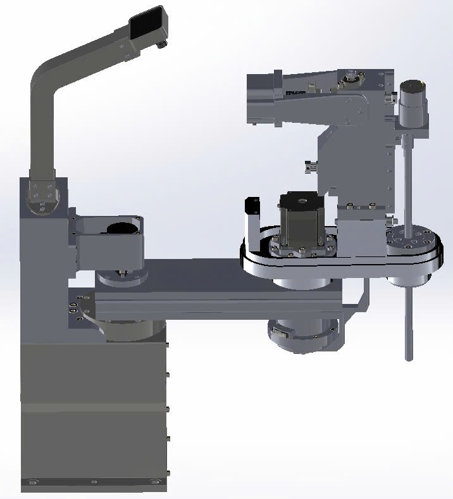

# SCARA Robot - SolidWorks Design

## Overview

This repository contains the complete SolidWorks 3D models, assemblies, and mechanical design for a SCARA (Selective Compliance Articulated Robot Arm) Robot, designed as part of a graduation project.

## Engineering Standards

All technical drawings in this project have been standardized and drawn using the **TCVN** (Tiêu chuẩn Việt Nam / Vietnamese Standards). 

The specific standard files, sheet formats, and drawing templates utilized for these designs are defined and located in the `ZZ_TEMPLATE` directory.

### Templates Used (`ZZ_TEMPLATE`)
- **Drafting Standard**: `TCVN-MODIFIED.sldstd`
- **Sheet Formats**: A0, A3, CNC, and 3D specific drafting templates

## Project Structure

- `FULLLLL.SLDASM`: Main complete robot assembly
- `Base/`: Base components and mounting 
- `Link 1/`, `Link 2/`, `Link 3 -- 4/`, `Link EE/`: Articulated arm links and end-effector models
- `SharedComponents/`: Fasteners, bearings, and common parts used across different assemblies
- `ZZ_TEMPLATE/`: TCVN drawing templates and sheet formats
